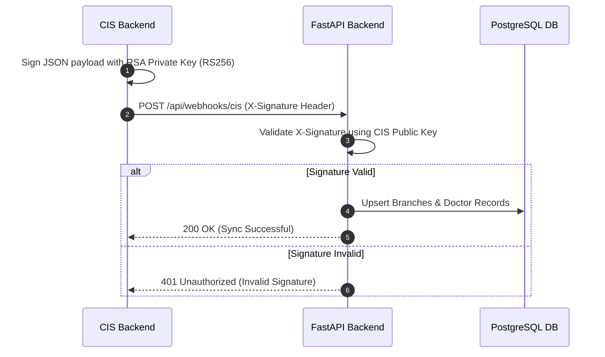

# Arya Noble AI Chatbot System

Enterprise Skin Clinic AI Chatbot Monorepo powering intelligent clinical assistance, multi-stage knowledge base RAG retrieval, clinic branch & token administration, S3/MinIO object storage, and automated Clinic Information System (CIS) data integration.

---

## Table of Contents

1. [System Architecture](#system-architecture)
2. [Project Modules & Scope Index](#project-modules--scope-index)
3. [Technology Stack Matrix](#technology-stack-matrix)
4. [Application Portals & Route Matrix](#application-portals--route-matrix)
5. [Quick Start with Docker Compose](#quick-start-with-docker-compose)
6. [Service Endpoints & Port Map](#service-endpoints--port-map)
7. [Core System Workflows](#core-system-workflows)
   - [Knowledge Ingestion & Staged Review](#1-knowledge-ingestion--staged-review)
   - [Dual-Tier Token & Quota Management](#2-dual-tier-token--quota-management)
   - [CIS Integration & RSA-Signed Webhooks](#3-cis-integration--rsa-signed-webhooks)
8. [Repository Structure](#repository-structure)

---

## Project Modules & Scope IndexS

| Directory / Module                                                                                       | Description                                                                                                                 | Primary Tech Stack                                                                                 | Documentation                                                                                                        |
| :------------------------------------------------------------------------------------------------------- | :-------------------------------------------------------------------------------------------------------------------------- | :------------------------------------------------------------------------------------------------- | :------------------------------------------------------------------------------------------------------------------- |
| [**`backend/`**](file:///d:/Work/Company/widya-robotics/projects/arya-noble/project/backend/README.md)   | FastAPI Modular Monolith REST API backend powering core services, MinIO asset storage, and enterprise RAG pipeline.         | Python 3.11+, FastAPI, SQLAlchemy (AsyncIO), PostgreSQL (`pgvector`), MinIO/S3, Docling, LangChain | [Backend README](file:///d:/Work/Company/widya-robotics/projects/arya-noble/project/backend/README.md)               |
| [**`frontend/`**](file:///d:/Work/Company/widya-robotics/projects/arya-noble/project/frontend/README.md) | Next.js App Router client featuring Unified Dashboard (`/dashboard`), Doctor Assistant (`/doctor`), and Chatbot Widget.     | Next.js 16 (Turbopack), React 19, TypeScript, Tailwind CSS v4, TanStack Query v5, TipTap MdForge   | [Frontend README](file:///d:/Work/Company/widya-robotics/projects/arya-noble/project/frontend/README.md)             |
| [**`mock-cis/`**](file:///d:/Work/Company/widya-robotics/projects/arya-noble/project/mock-cis/README.md) | Mock Clinic Information System (CIS) pushing RSA-signed branch and doctor master data to backend with RS256 SSO simulation. | Python 3.11, FastAPI, Cryptography (RSA-SHA256), HTTPX, React Chatbot Reference                    | [Mock CIS README](file:///d:/Work/Company/widya-robotics/projects/arya-noble/project/mock-cis/README.md)             |
| [**`docs/`**](file:///d:/Work/Company/widya-robotics/projects/arya-noble/project/docs)                   | Architecture guides, CIS integration blueprints, test sets, and engineering risk analyses.                                  | Markdown Documentation                                                                             | [CIS Guide](file:///d:/Work/Company/widya-robotics/projects/arya-noble/project/docs/cis-integration-guide.md)        |
| [**`scripts/`**](file:///d:/Work/Company/widya-robotics/projects/arya-noble/project/scripts)             | Telemetry and operational support scripts (e.g., bandwidth tracking).                                                       | Python 3.11                                                                                        | [Bandwidth Tracker](file:///d:/Work/Company/widya-robotics/projects/arya-noble/project/scripts/bandwidth_tracker.py) |

---

## Technology Stack Matrix

| Layer                      | Technologies & Libraries                                                                                                                                                                                                                         |
| :------------------------- | :----------------------------------------------------------------------------------------------------------------------------------------------------------------------------------------------------------------------------------------------- |
| **Frontend Web App**       | Next.js 16 (App Router with Turbopack), React 19, TypeScript 5, Tailwind CSS v4, `@base-ui/react`, `@shadcn/react`, TanStack Query v5, TanStack Form, Zod v4, TipTap (MdForge WYSIWYG Markdown Editor), Remixicon, Lucide icons, Sonner (Toasts) |
| **Backend API Core**       | Python 3.11+, FastAPI, Uvicorn, SQLAlchemy 2.0 (AsyncIO), Alembic, Pydantic v2, APScheduler (Background CIS sync), Loguru (Structured logging), `speedtest-cli`                                                                                  |
| **Database & Vectors**     | PostgreSQL 16 with `pgvector` extension (HNSW indexing, cosine similarity), `asyncpg`, `psycopg[binary]`                                                                                                                                         |
| **Object Storage**         | MinIO Object Storage (S3-compatible dual-bucket: `images` & `knowledge-documents`), AWS SDK (`boto3` / `aioboto3`), background auto-sync flush worker                                                                                            |
| **RAG & AI Pipeline**      | LangChain, HuggingFace Transformers (`BAAI/bge-m3`), OpenAI (`gpt-4o-mini`), Google Gemini, Docling document parser, PyMuPDF, `rank-bm25` (Sparse keyword retrieval), Cross-Encoder Reranker (`BAAI/bge-reranker-base`)                          |
| **Security & Auth**        | OAuth2 JWT in `HttpOnly` cookies, bcrypt password hashing, granular Role-Based Access Control (RBAC), RSA-SHA256 payload signature verification (`X-Signature`), RS256 SSO token verification                                                    |
| **Orchestration & DevOps** | Docker, Docker Compose (Multi-stage development and production builds), Jenkinsfile CI/CD pipeline                                                                                                                                               |

---

## Application Portals & Route Matrix

### 1. Unified Management Dashboard (`/dashboard`)

- **`/dashboard/knowledge`**: Master knowledge document repository, filtering by category (`?category=...`), status tabs, search, and delete management.
  - **`/dashboard/knowledge/[id]`**: Single document chunk inspector and MdForge WYSIWYG editor.
  - **`/dashboard/knowledge/batch/[id]`**: Multi-document batch review queue with per-document status tabs and pipeline visualization.
  - **`/dashboard/knowledge/project/[id]`**: Project collection viewer for grouped knowledge assets.
- **`/dashboard/ingest`**: Drag-and-drop document uploader with progress tracking.
  - **`/dashboard/ingest/chat`**: Interactive conversational ingestion workflow for unstructured knowledge ingestion.
- **`/dashboard/branches`**: Clinic branch management, quota allocation, custom token limit overrides, and "Reset to Global Pool" controls.
- **`/dashboard/category`**: Hierarchical product and treatment category taxonomy manager with URL query state synchronization.
- **`/dashboard/chat-history`**: Historical doctor and user consultation audit logs, token consumption analytics, and full conversation inspection.
  - **`/dashboard/chat-history/[id]`**: Individual chat session message inspection.
- **`/dashboard/configuration`**: Dynamic LLM model selection (OpenAI / Gemini), API key credentials, embedding models, and global token quota rules.
- **`/dashboard/users` & `/dashboard/roles`**: User management, granular permission matrices, and doctor token adjustments.
- **`/dashboard/notifications`**: Real-time system alert feed and background task completion updates.

### 2. Doctor Clinical Assistant (`/doctor`)

- **`/doctor`**: Clinical portal home with quick actions, recent patient chats, and medical search.
- **`/doctor/chat/[id]`**: Real-time clinical AI assistant with Server-Sent Events (SSE) token streaming, markdown formatting, medical citations, and image previews.
- **`/doctor/search`**: Direct hybrid vector + keyword search engine across clinical guidelines, treatments, and medications.

### 3. Embeddable Widget Demo (`/widget-demo`)

- **`/widget-demo`**: Live interactive demo of the standalone floating chatbot widget designed for third-party CIS integration.

---

## Quick Start with Docker Compose

Ensure Docker Engine and Docker Compose are installed, then run from the project root:

### 1. Launch All Services (Development Mode)

```bash
docker compose up --build
```

### 2. Launch All Services (Production Mode)

```bash
docker compose -f docker-compose.prod.yaml up --build -d
```

### 3. Stop All Services

```bash
docker compose down
```

---

## Service Endpoints & Port Map

| Service                  | Host / Local URL               | Internal Port | Key Documentation / Interfaces                             |
| :----------------------- | :----------------------------- | :------------ | :--------------------------------------------------------- |
| **Frontend Web App**     | `http://localhost:3000`        | `3000`        | Unified `/dashboard`, `/doctor` portal, and `/widget-demo` |
| **Backend OpenAPI Docs** | `http://localhost:8000/docs`   | `8000`        | Interactive Swagger UI with JWT Cookie & Bearer auth       |
| **Backend ReDoc**        | `http://localhost:8000/redoc`  | `8000`        | Complete API specification reference                       |
| **Backend Health Check** | `http://localhost:8000/health` | `8000`        | Service health status JSON                                 |
| **Mock CIS Web & API**   | `http://localhost:8001`        | `8001`        | Mock CIS Swagger (`/docs`) & Dashboard (`/dashboard`)      |
| **PostgreSQL Database**  | `localhost:50010`              | `5432`        | Relational DB + `pgvector` (`arya_noble`)                  |
| **MinIO API (S3)**       | `http://localhost:9000`        | `9000`        | S3-compatible object storage API                           |
| **MinIO Web Console**    | `http://localhost:9001`        | `9001`        | MinIO Storage Console (`minioadmin` / `minioadmin`)        |

---

## Core System Workflows

### 1. Knowledge Ingestion & Staged Review

```mermaid
flowchart LR
    UploadDoc["Upload PDF / MD<br/><code>/dashboard/ingest</code>"] -->|"POST /api/knowledge/upload"| ProcessingState["Status: PROCESSING"]
    ProcessingState --> DoclingParse["Docling Parser & Semantic Chunker"]
    DoclingParse --> AISummary["AI Executive Summary"]
    AISummary --> PendingState["Status: PENDING"]
    PendingState --> AdminReview["Admin Review & MdForge WYSIWYG Edit<br/><code>/knowledge/batch/[id]</code>"]
    AdminReview -->|"POST /api/knowledge/{id}/approve"| ApprovedState["Status: APPROVED"]
    ApprovedState --> VectorDB[("pgvector HNSW Index<br/>(Live in RAG Queries)")]
```



1. **Document Upload**: Users upload files via `/dashboard/ingest` or `/dashboard/ingest/chat`. Files are saved to MinIO object storage.
2. **Background Ingestion Pipeline**: Docling extracts structured text, tables, and images. The Custom Chunker creates semantic chunks with character offsets.
3. **AI Summarization**: An executive summary is automatically generated, and the document is transitioned to `PENDING` status.
4. **Staged Batch Review**: Admins inspect parsed chunks, edit markdown content using the integrated **MdForge WYSIWYG editor**, verify category mappings, and click approve.
5. **Vector Indexing**: Upon approval (`APPROVED`), vector embeddings (`BAAI/bge-m3`) are stored in PostgreSQL via `pgvector` with HNSW indexing, immediately available for RAG search.

### 2. Dual-Tier Token & Quota Management

1. **Global Pool Baseline**: Configured in `/dashboard/configuration`, defining default monthly token quotas for all branches and doctors.
2. **Custom Branch Overrides**: Branch administrators can set explicit custom token limits per branch (`has_custom_limit=True`). Branches can be strictly blocked by assigning a `0` token limit.
3. **Reset to Global Pool**: Updating the global token rule or triggering "Reset to Global Pool" in the branch dialog automatically clears custom overrides (`has_custom_limit=False`) and resynchronizes the branch with the global pool.

### 3. CIS Integration & RSA-Signed Webhooks



1. **One-Way Push**: External CIS systems push branch and doctor updates directly to `POST /api/webhooks/cis`.
2. **RSA-SHA256 Signature**: The webhook request body is signed with the CIS RSA Private Key (`RS256`). The backend validates the signature in the `X-Signature` header against the public key (`CIS_RSA_PUBLIC_KEY_PATH=keys/cis_public_key.pem`).
3. **Automated Seed & Hourly Sync**: `mock-cis` automatically pushes initial seed data (`bulk.sync`) upon startup and triggers hourly background syncs.

---

## Repository Structure

```text
.
├── backend/                        # FastAPI Backend Core & RAG Subsystem
│   ├── alembic/                    # Database migration scripts & revision history
│   ├── app/
│   │   ├── api/                    # REST API controllers & router definitions
│   │   │   ├── dependencies.py     # Auth guards, DB session injection, RBAC permissions
│   │   │   └── routers/            # Feature routers (auth, branches, chats, knowledge, etc.)
│   │   ├── core/                   # Infrastructure config, database, security, and logger
│   │   ├── models/                 # SQLAlchemy ORM models (Branch, User, Knowledge, Chat, etc.)
│   │   ├── rag/                    # AI Subsystem (Docling, Embedder, Hybrid Retriever, LLM)
│   │   ├── schemas/                # Pydantic request/response DTO schemas
│   │   └── services/               # Business services (TokenService, StorageService, CISSync)
│   ├── data/                       # Local data, storage fallback, and upload workspace
│   ├── Dockerfile                  # Multi-stage backend container specification
│   ├── requirements.txt            # Python dependencies (Core + RAG)
│   └── seed.py                     # Database seeder script
│
├── frontend/                       # Next.js App Router Web Client
│   ├── public/                     # Static assets, brand logos, and icons
│   ├── src/
│   │   ├── app/                    # Next.js App Router pages, layouts, and route handlers
│   │   │   ├── dashboard/          # Unified Admin & Functional Portal (/dashboard)
│   │   │   ├── doctor/             # Doctor Clinical Assistant Portal (/doctor)
│   │   │   ├── login/              # Authentication login page
│   │   │   ├── widget-demo/        # Embeddable Chatbot Widget preview
│   │   │   └── globals.css         # Global Tailwind directives, theme variables, & editor styles
│   │   ├── components/             # Reusable UI component library (Shadcn + Shared + MdForge)
│   │   ├── hooks/                  # Custom React hooks (TanStack Query hooks, state management)
│   │   └── lib/                    # Axios client instance, TypeScript types, and utilities
│   ├── Dockerfile                  # Multi-stage frontend container specification
│   └── package.json                # Frontend dependencies and npm scripts
│
├── mock-cis/                       # Mock Clinic Information System
│   ├── app/                        # Mock CIS FastAPI backend and webhook trigger endpoints
│   ├── frontend/                   # Mock CIS web dashboard & Reference React Floating Chatbot
│   ├── keys/                       # RSA Public & Private keypairs for webhook signing & SSO
│   └── Dockerfile                  # Mock CIS container specification
│
├── docs/                           # Architecture guides, CIS integration specs, & test sets
├── scripts/                        # Operational scripts (e.g., bandwidth tracking)
├── docker-compose.yaml             # Development container orchestration manifest
├── docker-compose.prod.yaml        # Production container orchestration manifest
├── CHANGELOG.md                    # Detailed release notes and modification logs
└── README.md                       # Project root documentation
```

---

## Developer Quick Commands

### Backend

```bash
cd backend
python -m venv venv && source venv/bin/activate  # (Windows: venv\Scripts\activate)
pip install -r requirements.txt
alembic upgrade head
python seed.py
uvicorn app.main:app --reload --port 8000
```

### Frontend

```bash
cd frontend
pnpm install
pnpm dev      # Runs on http://localhost:3000
pnpm build    # Production build validation
```
