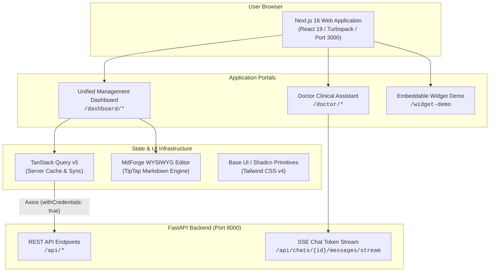

# Arya Noble AI Chatbot - Frontend Service

Next.js 16 (App Router with Turbopack) web interface powering the Skin Clinic AI Chatbot system. It provides role-scoped portals for System Administrators, Functional Staff, and Clinic Doctors, alongside a rich WYSIWYG Markdown editor, streaming RAG chat interfaces, and an embeddable customer chatbot widget preview.

---

## Table of Contents

1. [Overview & Architecture](#overview--architecture)
2. [Tech Stack & Key Dependencies](#tech-stack--key-dependencies)
3. [Directory & Module Architecture](#directory--module-architecture)
4. [Role-Based Portals & Application Flow](#role-based-portals--application-flow)
5. [Environment Variables & Configuration](#environment-variables--configuration)
6. [Setup, Run & Build Commands](#setup-run--build-commands)
7. [Component Architecture & UI System](#component-architecture--ui-system)
8. [Operational Troubleshooting](#operational-troubleshooting)

---

## Overview & Architecture

The frontend is built with **Next.js 16 (App Router)** and **React 19**, organized into two main role-scoped portal layouts (`/dashboard` and `/doctor`) and an embeddable widget preview (`/widget-demo`):

- **Role-Based Access Control (RBAC)**: Granular access control based on user roles and permissions, rendering sidebar navigation and route access dynamically.
- **API Client Layer (`src/lib/axios.ts`)**: Configured Axios instance with `withCredentials: true` to handle HTTP-only JWT authentication cookies issued by the FastAPI backend.
- **State Management & Caching**: [TanStack Query (React Query v5)](https://tanstack.com/query/latest) for server state caching, optimistic mutations, query key invalidation, and URL search param synchronization (`?category=...`).
- **Rich Markdown Editing (MdForge)**: Integrated TipTap WYSIWYG editor supporting live table manipulation, formatted code blocks, and markdown shortcuts for knowledge document review.
- **Real-Time Streaming**: Server-Sent Events (SSE) streaming for real-time AI token generation in doctor consultation chats.



---

## Tech Stack & Key Dependencies

- **Framework**: [Next.js 16](https://nextjs.org/) (App Router, Turbopack), [React 19](https://react.dev/), TypeScript 5
- **Styling & UI**: [Tailwind CSS v4](https://tailwindcss.com/), `@base-ui/react`, `@shadcn/react`, Remixicon (`@remixicon/react`), Lucide icons, `next-themes` (Light/Dark theme support)
- **Data Fetching & State**: [TanStack React Query v5](https://tanstack.com/query/latest), [Axios](https://axios-http.com/)
- **Forms & Validation**: TanStack Form, Zod v4
- **Markdown & WYSIWYG Editor**: [TipTap](https://tiptap.dev/) (`@tiptap/react`, `@tiptap/pm`, `@tiptap/extension-table`, `tiptap-markdown`), `react-markdown`, `remark-gfm`
- **Notifications**: Sonner (Toast system)
- **Package Manager**: `pnpm` v11+

---

## Directory & Module Architecture

```text
frontend/
├── public/                       # Static public assets, clinic logos, & icons
├── src/
│   ├── app/                      # Next.js App Router pages & layouts
│   │   ├── dashboard/            # Unified Management Portal Routes
│   │   │   ├── branches/         # Branch quota & token limit management
│   │   │   ├── category/         # Product & treatment categories with URL sync
│   │   │   ├── chat-history/     # Session logs & RAG chat audit logs ([id])
│   │   │   ├── configuration/    # AI models, LLM API keys, & global token rules
│   │   │   ├── ingest/           # Knowledge file uploader & /ingest/chat
│   │   │   ├── knowledge/        # Knowledge table, [id], batch/[id], project/[id]
│   │   │   ├── notifications/    # Real-time system alert stream
│   │   │   ├── roles/            # RBAC role permissions matrix
│   │   │   ├── users/            # User account management & doctor quota adjustments
│   │   │   └── layout.tsx        # Dashboard shell with dynamic RBAC sidebars
│   │   ├── doctor/               # Doctor Clinical Assistant Routes
│   │   │   ├── chat/             # SSE-streaming clinical AI consultation ([id])
│   │   │   ├── search/           # Hybrid vector & keyword clinical search
│   │   │   └── layout.tsx        # Doctor portal navigation shell
│   │   ├── login/                # Authentication login page
│   │   ├── widget-demo/          # Embeddable AI chatbot widget preview
│   │   ├── globals.css           # Tailwind v4 directives, custom tokens, & editor styles
│   │   └── layout.tsx            # Root application layout & global context providers
│   ├── components/               # UI & Shared Component Library
│   │   ├── auth/                 # Login forms & auth route guards
│   │   ├── layout/               # Header, Sidebar, Global Search Bar, & App Shell
│   │   ├── providers/            # React Query Provider, Theme Provider wrappers
│   │   ├── shared/               # Reusable business components
│   │   │   ├── markdown/         # Markdown card renderers (product, treatment, etc.)
│   │   │   ├── wysiwyg-editor/   # MdForge TipTap rich-text editor & toolbar
│   │   │   ├── data-table-*      # Standardized pagination, sorting, & skeletons
│   │   │   └── floating-chat-*   # Standalone widget component
│   │   └── ui/                   # Base Radix/Shadcn primitives (Dialog, Button, Sheet, etc.)
│   ├── hooks/                    # Custom React Hooks
│   │   ├── use-current-user.ts   # Active user profile query hook
│   │   ├── use-mobile.ts         # Viewport responsiveness hook
│   │   └── use-session.tsx       # Auth session lifecycle hook
│   └── lib/                      # Utilities & API Configuration
│       ├── axios.ts              # Pre-configured Axios client (NEXT_PUBLIC_API_URL + cookies)
│       ├── types.ts              # TypeScript DTO interfaces & enum types
│       └── utils.ts              # Tailwind merge & stripMarkdown sanitization helper
├── .env                          # Local environment variables (git-ignored)
├── .env.example                  # Environment configuration template
├── components.json               # Shadcn UI configuration manifest
├── next.config.ts                # Next.js build & Turbopack configuration
├── package.json                  # Dependencies & script definitions
├── pnpm-lock.yaml                # Lockfile for reproducible builds
└── tsconfig.json                 # TypeScript compiler configuration
```

---

## Role-Based Portals & Application Flow

| Portal / Route | Accessible Roles | Key Capabilities & Features |
| :--- | :--- | :--- |
| **`/login`** | Public | User authentication endpoint issuing HTTP-only JWT cookies. |
| **`/dashboard`** | Admin / Staff | Unified dashboard landing page based on RBAC permissions. |
| **`/dashboard/knowledge`** | Admin / Staff | Master knowledge repository, category query sync, search, and delete actions. |
| **`/dashboard/knowledge/[id]`** | Admin / Staff | Single document chunk inspector with MdForge WYSIWYG editor. |
| **`/dashboard/knowledge/batch/[id]`** | Admin / Staff | Multi-document batch review queue with per-document status tabs. |
| **`/dashboard/knowledge/project/[id]`** | Admin / Staff | Project collection viewer for grouped knowledge assets. |
| **`/dashboard/ingest`** | Admin / Staff | File uploader with progress tracking and `/ingest/chat` conversational workflow. |
| **`/dashboard/branches`** | Admin | Clinic branch quota management, custom token limit overrides, and "Reset to Global Pool". |
| **`/dashboard/category`** | Admin / Staff | Hierarchical category taxonomy with URL query parameter synchronization (`?category=...`). |
| **`/dashboard/chat-history`** | Admin | Consultation audit logs, token consumption analytics, and chat review. |
| **`/dashboard/configuration`** | Admin | Dynamic LLM model toggle, API keys, embedding providers, and global token limits. |
| **`/dashboard/users` & `/roles`** | Admin | Create and manage users, assign RBAC permissions, and adjust doctor token quotas. |
| **`/dashboard/notifications`** | Admin / Staff | Real-time system alert stream and ingestion status updates. |
| **`/doctor/chat`** | Doctor | Clinical AI assistant with SSE token streaming, Markdown formatting, and citations. |
| **`/doctor/search`** | Doctor | Direct hybrid vector & keyword search across clinic treatments and medications. |
| **`/widget-demo`** | Public / Demo | Preview of the embeddable customer-facing chat widget. |

---

## Environment Variables & Configuration

Create a `.env` file in the `frontend/` directory by copying `.env.example`:

```bash
cp .env.example .env
```

```env
# --- FastAPI Backend Base URL ---
NEXT_PUBLIC_API_URL=http://localhost:8000/api
```

---

## Setup, Run & Build Commands

### 1. Install Dependencies
```bash
# Install packages using pnpm
pnpm install
```

### 2. Launch Development Server
```bash
# Starts Next.js Turbopack dev server on http://localhost:3000
pnpm dev
```

### 3. Production Build & Execution
```bash
# Build optimized production bundle
pnpm build

# Start production server
pnpm start
```

### 4. Running via Root Docker Compose
```bash
# From project root directory:
docker compose up --build frontend

# Or run all project services in production mode
docker compose -f docker-compose.prod.yaml up --build frontend
```

### 5. Code Quality & Linting
```bash
# Run ESLint checks across the codebase
pnpm lint
```

---

## Component Architecture & UI System

- **Shadcn / Base UI Primitives**: Located in `src/components/ui/`, styled with Tailwind CSS utility classes and `clsx` / `tailwind-merge`.
- **MdForge WYSIWYG Editor**: Located in `src/components/shared/wysiwyg-editor/`, provides a TipTap toolbar and editor for rich-text markdown creation and editing.
- **API Interceptor & Credentials**: [`src/lib/axios.ts`](file:///d:/Work/Company/widya-robotics/projects/arya-noble/project/frontend/src/lib/axios.ts) automatically attaches `withCredentials: true` so all requests seamlessly pass HTTP-only authentication cookies.
- **RAG Streaming Markdown**: Real-time token streaming with syntax-highlighted code blocks, tables, and sanitized content via `stripMarkdown`.

---

## Operational Troubleshooting

### 1. CORS or 401 Unauthorized Errors
- **Symptom**: API requests fail with CORS origin error or instant 401 redirect.
- **Resolution**:
  - Ensure `NEXT_PUBLIC_API_URL` in `frontend/.env` points to `http://localhost:8000/api`.
  - Verify `allow_origins` in backend [`app/main.py`](file:///d:/Work/Company/widya-robotics/projects/arya-noble/project/backend/app/main.py) includes `http://localhost:3000`.

### 2. Stale React Query Cache
- **Symptom**: Updated branch token limit or document status does not reflect immediately.
- **Resolution**: React Query automatically invalidates query keys on mutations. Refresh the page or clear browser local cache if needed.
