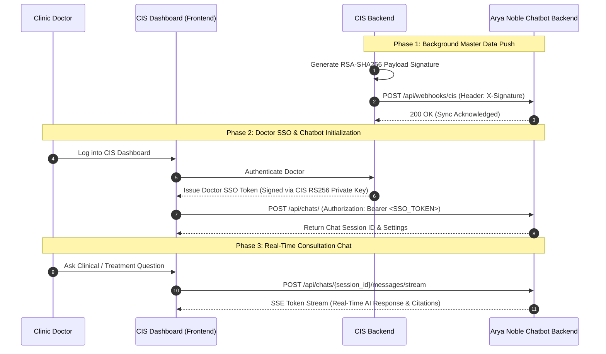
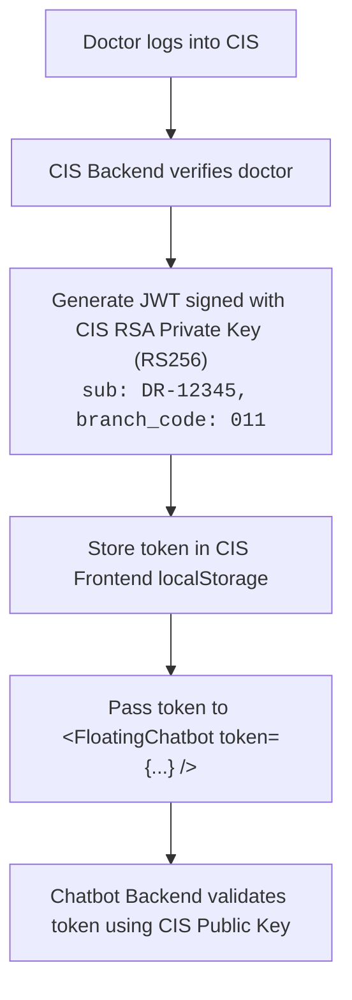

# Mock CIS (Clinic Information System) Service

This module simulates the external **Clinic Information System (CIS)** environment. It serves as both an automated integration testbed and a **reference implementation** for external CIS development teams integrating with the Arya Noble AI Chatbot ecosystem.

---

## Table of Contents

1. [Integration Architecture](#integration-architecture)
2. [Master Data Synchronization (Push-Only)](#1-master-data-synchronization-push-only)
3. [Seamless Doctor SSO Authentication](#2-seamless-doctor-sso-authentication)
4. [Floating Chatbot Widget Integration](#3-floating-chatbot-widget-integration)
5. [API Endpoints Reference](#api-endpoints-reference)
6. [Local Setup & Execution](#local-setup--execution)

---

## Integration Architecture



---

## 1. Master Data Synchronization (Push-Only)

The CIS pushes real-time master data (Branches and Doctors) to the AI Chatbot Backend via **RSA-signed webhooks**.

### Key Rules:
- **Push-Only Architecture**: The Chatbot Backend never polls the CIS. The CIS pushes updates to `POST /api/webhooks/cis`.
- **Security & Payload Signing**: Payloads are signed using the **CIS RSA Private Key** (`RS256`). The base64-encoded signature is transmitted in the `X-Signature` HTTP header.
- **Automated Sync Worker**: On startup, `mock-cis` automatically pushes initial seed data (`bulk.sync`) and triggers an automated background push every **1 hour**.

### Webhook Event Types:

| Event Type | Description | Sample Payload Scope |
| :--- | :--- | :--- |
| `branch.upsert` | Insert or update clinic branch locations. | `branch_code`, `name`, `address`, `city`, `phone`, `status` |
| `doctor.upsert` | Insert or update doctor credentials. | `doctor_id`, `name`, `specialization`, `branch_code`, `email` |
| `bulk.sync` | Full master data synchronization. | List of all active branches and registered doctors |

---

## 2. Seamless Doctor SSO Authentication

To provide a seamless experience, doctors logged into the CIS are automatically authenticated when interacting with the Chatbot widget without a second login prompt.



### Token Specifications:
- **Algorithm**: `RS256`
- **Signing Key**: CIS RSA Private Key (`keys/cis_private_key.pem`)
- **Required Claims**:
  - `sub`: Unique Doctor ID (e.g. `"DR-12345"`)
  - `name`: Doctor Full Name (e.g. `"Dr. Jane Doe, Sp.D.V.E."`)
  - `branch_code`: Current Active Branch Code (e.g. `"011"`)
  - `exp`: Token Expiration Timestamp

---

## 3. Floating Chatbot Widget Integration

The mock service provides a reference implementation (`frontend/src/components/FloatingChatbot.jsx`) demonstrating how to embed the Chatbot widget inside third-party React applications.

### Integration Steps:

1. **Import the Component**: Copy `FloatingChatbot.jsx` and `FloatingChatbot.css` into your application.
2. **Inject Props**:
   ```jsx
   import FloatingChatbot from "@/components/FloatingChatbot";

   export default function DoctorDashboard() {
     return (
       <div className="cis-layout">
         {/* CIS Dashboard Content */}
         <FloatingChatbot
           token="eyJhbGciOiJSUzI1Ni..."
           doctorName="Dr. Jane Doe, Sp.D.V.E."
           branchCode="011"
           apiBaseUrl="http://localhost:8000"
         />
       </div>
     );
   }
   ```
3. **Internal Component Flow**:
   - **Session Creation**: Calls `POST /api/chats/` with `{ branch_code: "011" }`.
   - **SSE Streaming**: Calls `POST /api/chats/{session_id}/messages/stream` to receive real-time streaming answer tokens.
   - **Attachments**: Supports multipart file uploads to `POST /api/chats/{session_id}/messages`.

---

## API Endpoints Reference

### Chatbot Backend APIs (Target for CIS Integration)

| Method | Endpoint | Description | Auth Header |
| :--- | :--- | :--- | :--- |
| `POST` | `/api/webhooks/cis` | Receive Master Data sync payload | `X-Signature: <RSA_SHA256_BASE64>` |
| `POST` | `/api/chats/` | Create a new doctor chat session | `Authorization: Bearer <SSO_TOKEN>` |
| `POST` | `/api/chats/{id}/messages/stream` | Stream real-time AI response (SSE) | `Authorization: Bearer <SSO_TOKEN>` |
| `POST` | `/api/chats/{id}/messages` | Send message with file attachments | `Authorization: Bearer <SSO_TOKEN>` |
| `GET` | `/api/chats/{id}/messages` | Retrieve session message history | `Authorization: Bearer <SSO_TOKEN>` |

### Mock CIS Endpoints (Simulation & Testing)

| Method | Endpoint | Description |
| :--- | :--- | :--- |
| `POST` | `/auth/login` | Simulates doctor login and returns RS256 SSO token |
| `POST` | `/trigger/push-doctor` | Manually sync a single doctor record to the AI backend |
| `POST` | `/trigger/push-all` | Manually trigger a full bulk master data sync (`bulk.sync`) |

---

## Local Setup & Execution

### 1. Running via Docker Compose

```bash
# Run standalone Mock CIS (Backend + UI):
docker compose -f mock-cis/docker-compose.yaml up --build

# Or run within root monorepo stack:
docker compose up --build mock-cis
```

- **Mock CIS Dashboard (UI)**: `http://localhost:8001/dashboard`
- **Mock CIS Swagger Docs**: `http://localhost:8001/docs`

### 2. Standalone Python Run

```bash
cd mock-cis
pip install -r requirements.txt
uvicorn app.main:app --reload --port 8001
```
